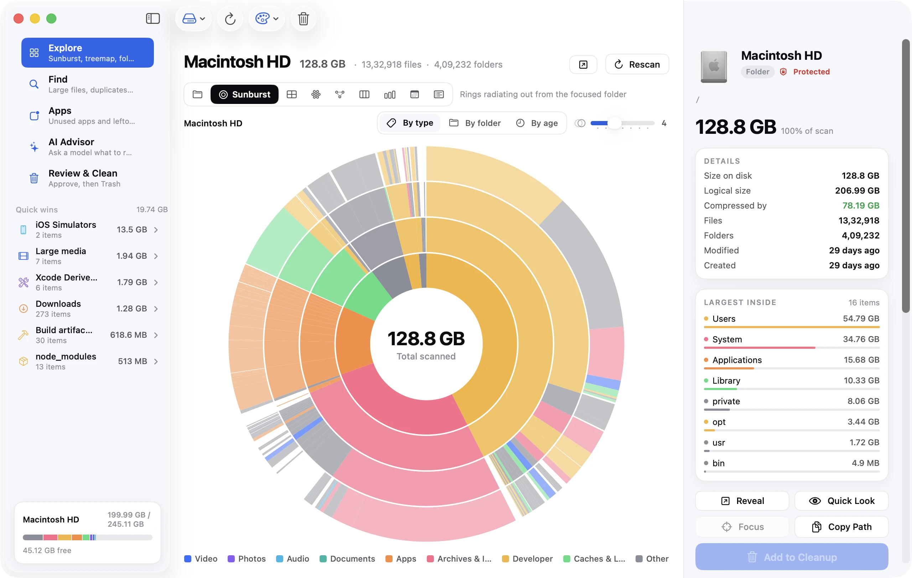
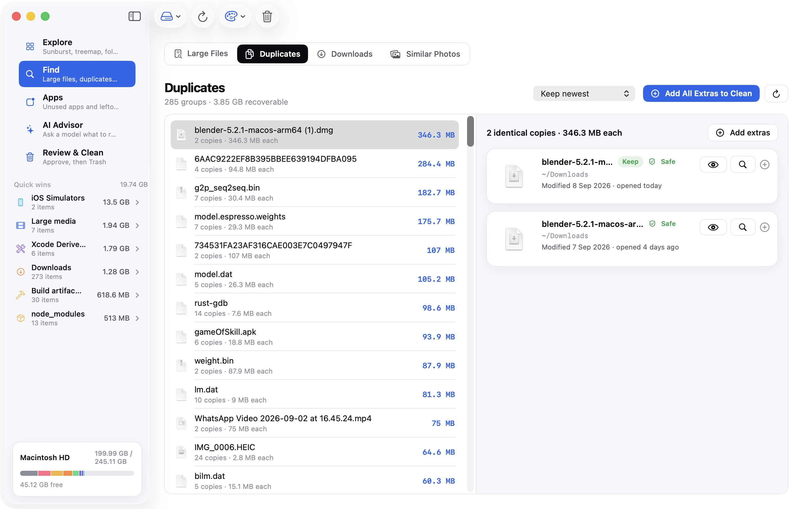
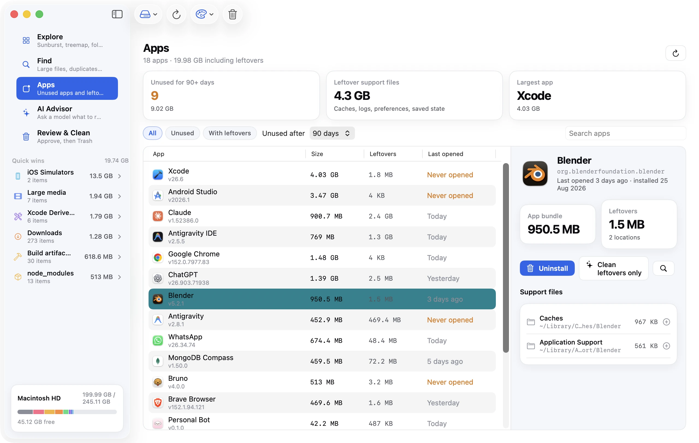
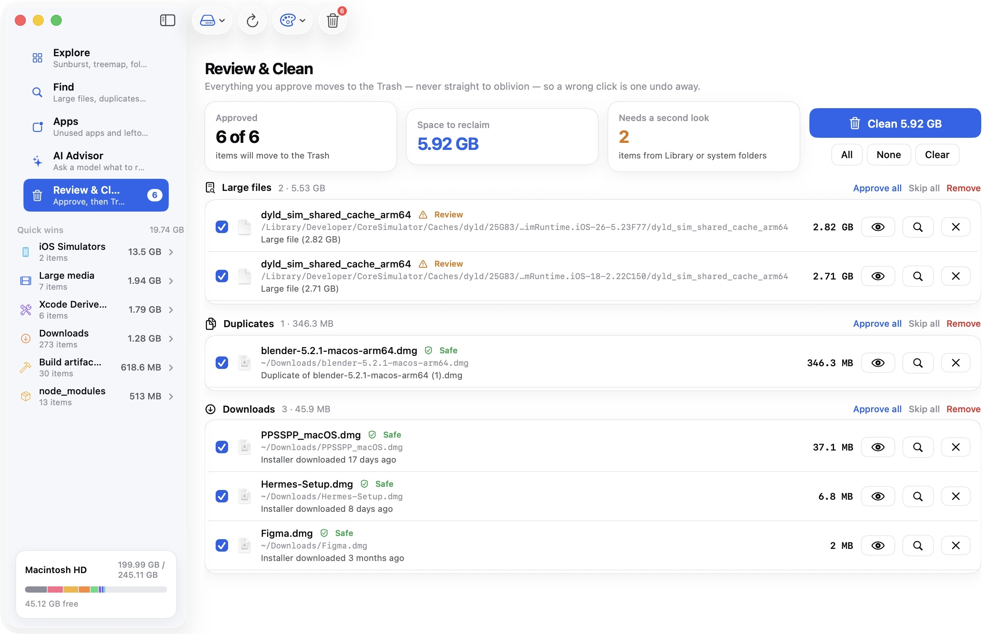

<p align="center">
  
</p>

<h1 align="center">Disk Clean AI</h1>

<p align="center">
  <strong>See what's filling up your Mac, and safely get the space back.</strong><br>
  Free, open-source storage cleaner for macOS. AI suggestions use your own OpenRouter key.
</p>

<p align="center">
  <a href="https://github.com/postmcp/diskcleanai/releases/latest/download/DiskCleanAI.zip"><strong>Download for macOS</strong></a> ·
  <a href="https://diskcleanai.com">Website</a> ·
  <a href="https://github.com/postmcp/diskcleanai/issues">Report a bug</a> ·
  <a href="CONTRIBUTING.md">Contribute</a>
</p>

<p align="center">
  <a href="https://github.com/postmcp/diskcleanai/actions/workflows/ci.yml"></a>
  <a href="https://github.com/postmcp/diskcleanai/releases/latest"></a>
  
  <a href="LICENSE"></a>
</p>



## Features

- **Explore** a whole volume or any folder in nine views: folders, sunburst, treemap, bubbles,
  mind map, icicle, top sizes, age map and list. Colour them by type, folder or age.
- **Find** large files, byte-identical duplicates, near-identical photos and stale downloads.
- **Apps**: spot apps you haven't opened in months and remove them together with their caches,
  preferences and other leftovers.
- **Quick wins** for caches and logs, iOS simulators, `node_modules`, Xcode DerivedData, build
  artefacts and the Trash.
- **AI Advisor** (optional): a model of your choice on [OpenRouter](https://openrouter.ai) reviews
  the scan and suggests what is safe to remove, with a reason for each item.
- **System tools**: a menu-bar monitor, a listening-ports viewer with kill, flush DNS, free memory,
  keep awake and more.
- **Nine themes**, from Ocean and Daylight to Nord and Sakura, or follow the system.

| Find duplicates | Apps and leftovers | Review & Clean |
| --- | --- | --- |
|  |  |  |

## Safe by design

- **Nothing is deleted outright.** Everything you approve goes to the macOS Trash as one batch,
  and **Undo** puts the whole batch back.
- **Protected paths**: the OS, system frameworks, keychains, SSH and GPG keys, Mail, Photos and
  anything inside an app bundle can never be queued.
- **Private**: scanning happens entirely on your Mac. The AI Advisor sends only metadata (paths,
  sizes, kinds, dates, never file contents) straight to OpenRouter, and "Show what was sent"
  shows the exact payload. Your key stays in the macOS Keychain.
- **No accounts, no telemetry, no server.** Apart from AI requests you start yourself, the only
  network call is a daily check of this repository's latest GitHub release, and you can turn it off.

## Install

1. Download [**DiskCleanAI.zip**](https://github.com/postmcp/diskcleanai/releases/latest/download/DiskCleanAI.zip)
   from the latest release (older versions are on the [releases page](https://github.com/postmcp/diskcleanai/releases)).
2. Unzip it and drag **Disk Clean AI** to Applications. Builds are signed with a Developer ID and notarized by Apple.
3. Optional: grant **Full Disk Access** (System Settings → Privacy & Security) so it can see everything.

Requires macOS 14 Sonoma or later, on Apple silicon or Intel. The app updates itself from new
releases on this repository.

## Build from source

```bash
git clone https://github.com/postmcp/diskcleanai.git
cd diskcleanai/macApp
open DiskCleanAI.xcodeproj   # Xcode 16+, run the DiskCleanAI scheme
```

No Apple Developer account is needed; the project signs ad-hoc. Run the tests with
`xcodebuild -project DiskCleanAI.xcodeproj -scheme DiskCleanAI test`.

| Folder | What it is |
| --- | --- |
| [`macApp/`](macApp) | The SwiftUI app. Its README covers architecture, the Explore patterns, themes and updates |
| [`landing/`](landing) | The Next.js website at [diskcleanai.com](https://diskcleanai.com), including the blog |
| [`UPDATING.md`](UPDATING.md) | How maintainers version, sign, notarize and publish a release |

## Contributing

Bug reports, fixes and ideas are very welcome. Read [CONTRIBUTING.md](CONTRIBUTING.md) to get
started, and please follow the [code of conduct](CODE_OF_CONDUCT.md). Security issues go through
[SECURITY.md](SECURITY.md), not public issues.

## License

[MIT](LICENSE) © 2026 Redesignr AI
# diskcleanai
# diskcleanai
# diskcleanai
